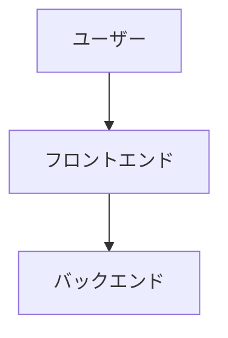

# Mermaid 図表集

このディレクトリには、Web Chat System の設計を可視化したMermaid図が含まれています。

## 図表一覧

### 1. システム構成図 (`system-architecture.md`)
- システム全体のアーキテクチャを示す図
- フロントエンド、ミドルウェア、バックエンドの各層の関係性
- 使用技術スタックとコンポーネントの配置

### 2. データベースER図 (`database-er.md`)
- データベースのテーブル設計とリレーションシップ
- Supabaseの認証テーブルとカスタムテーブルの関係
- 主キー、外部キー、制約の情報

### 3. チャットシーケンス図 (`chat-sequence.md`)
- メッセージ送信・受信の詳細なフロー
- リアルタイム通信の仕組み
- 認証、エラーハンドリング、セッション管理

### 4. 認証フロー図 (`auth-flow.md`)
- ユーザー認証の全体的なフロー
- サインアップ、ログイン、パスワードリセットの流れ
- セッション管理とエラーハンドリング

### 5. コンポーネント構造図 (`component-structure.md`)
- フロントエンドコンポーネントの構成と依存関係
- Next.js App Router の構造
- UIコンポーネントとビジネスロジックの分離

## Mermaid 図の表示方法

### GitHubでの表示
GitHubは標準でMermaidをサポートしているため、`.md`ファイル内の```mermaid```ブロックが自動的に図として表示されます。

### オンラインツール
1. [Mermaid Live Editor](https://mermaid.live/)
2. [Mermaid.js Online FlowChart & Diagrams Editor](https://mermaid-js.github.io/mermaid-live-editor/)

### エディタープラグイン
- **VS Code**: Mermaid Preview、Mermaid Markdown Syntax Highlighting
- **IntelliJ IDEA**: Mermaid Plugin
- **Vim**: vim-mermaid

### Markdownエディター
多くのMarkdownエディターがMermaidをサポート:
- Typora
- Mark Text
- Obsidian
- Notion

### ローカル環境
```bash
# Mermaid CLI をインストール
npm install -g @mermaid-js/mermaid-cli

# 図をPNGとして出力
mmdc -i diagram.mmd -o diagram.png

# 図をSVGとして出力  
mmdc -i diagram.mmd -o diagram.svg
```

## 図表の特徴

### 視覚的な分かりやすさ
- 絵文字を使用したアイコン表現
- カラフルな配色による視覚的な区別
- 階層構造の明確な表現

### GitHub対応
- GitHubで直接表示可能
- README.mdやドキュメントに埋め込み可能
- バージョン管理との親和性

### メンテナンス性
- テキストベースでの管理
- diff による変更の追跡
- 簡単な編集・更新

## 図表の更新

システムの設計変更時は、該当する図表も併せて更新してください。

1. **機能追加・変更** → 認証フロー図、コンポーネント構造図
2. **データベース変更** → ER図
3. **アーキテクチャ変更** → システム構成図
4. **フロー変更** → シーケンス図

## 図表の命名規則

- **ファイル名**: ケバブケース (`system-architecture.mmd`)
- **タイトル**: 日本語で分かりやすく
- **コンポーネント名**: 実際のファイル名・機能名に合わせる
- **絵文字**: 視覚的な理解を助けるために適切に使用

## 技術仕様

- **記法**: Mermaid syntax
- **バージョン**: Mermaid v10.x 対応
- **ファイル拡張子**: `.md` (Mermaidブロック含む)
- **エンコーディング**: UTF-8

## 使用例

```markdown
## システム構成図


```

上記のようにMarkdownファイル内で直接使用できます。

## 🌟 3D インタラクティブビューア

より没入感のある体験のために、**3D WebGL ビューア**を用意しました！

### 🚀 3D ビューアーの特徴

- **インタラクティブ3D表示**: マウスで回転・ズーム・パン操作
- **リアルタイム操作**: ノードクリックで詳細情報表示
- **美しいビジュアル**: Three.js による高品質3Dレンダリング
- **レスポンシブデザイン**: デスクトップ・タブレット・モバイル対応
- **複数レイアウト**: 階層・円形・3Dフォースレイアウト

### 📂 アクセス方法

```bash
# 3Dビューアーディレクトリに移動
cd docs/archi/3d-viewer

# ローカルサーバーで起動（推奨）
python -m http.server 8000
# または
npx serve .

# ブラウザでアクセス
open http://localhost:8000
```

### 🎮 操作方法

| 操作 | 機能 |
|------|------|
| **左クリック + ドラッグ** | カメラ回転 |
| **右クリック + ドラッグ** | カメラパン |
| **マウスホイール** | ズームイン/アウト |
| **ノードクリック** | 詳細情報表示 |
| **ダブルクリック** | ノードにフォーカス |
| **スペースキー** | カメラリセット |

### 🎨 表示可能な図表

1. **🏗️ システム構成図** - 全体アーキテクチャ
2. **🗄️ データベースER図** - DB設計とリレーション
3. **🧩 コンポーネント構造図** - フロントエンド構成
4. **🔐 認証フロー図** - 認証プロセス
5. **💬 チャットシーケンス図** - メッセージフロー

### 💡 3Dビューアーの利点

- **直感的理解**: 立体的な構造把握
- **詳細な探索**: インタラクティブな情報閲覧
- **プレゼンテーション**: チームでの説明に最適
- **モダンな体験**: 最新のWebGL技術を活用

3Dビューアーは従来のMermaid図を補完し、より深い理解を提供します。