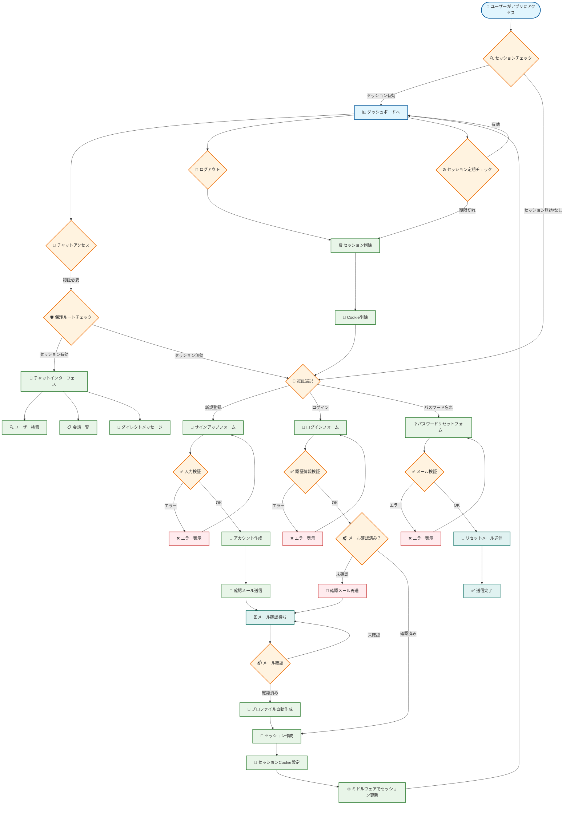

# 認証フロー図

Web Chat Systemの包括的な認証システムのフローチャートです。

## 認証フロー詳細説明

### 1. 初期アクセス・セッションチェック

#### アプリケーションアクセス
1. **ユーザーアクセス**: ユーザーがWebアプリケーションにアクセス
2. **セッションチェック**: Next.js MiddlewareでCookieベースのセッション確認
3. **認証状態判定**: 
   - セッション有効 → ダッシュボードへ直接遷移
   - セッション無効/なし → 認証画面へ

### 2. 認証選択

#### 認証方法の選択
ユーザーは以下の認証方法から選択：
- **新規登録**: 初回ユーザー向けアカウント作成
- **ログイン**: 既存ユーザー向け認証
- **パスワード忘れ**: パスワードリセット機能

### 3. サインアップフロー

#### 新規ユーザー登録
1. **入力検証**: メールアドレス・パスワード形式チェック
2. **アカウント作成**: Supabase Authでユーザーアカウント作成
3. **確認メール送信**: メールアドレス確認用リンクを送信
4. **メール確認待ち**: ユーザーが確認リンクをクリック
5. **プロファイル自動作成**: データベーストリガーで`user_profiles`テーブル作成

#### エラーハンドリング
- **入力エラー**: 不正な形式の場合、エラーメッセージ表示
- **重複メール**: 既存メールアドレスの場合、適切なエラー表示

### 4. ログインフロー

#### 既存ユーザー認証
1. **認証情報検証**: メールアドレスとパスワードの照合
2. **メール確認状態チェック**: 
   - 未確認 → 確認メール再送
   - 確認済み → セッション作成
3. **セッション作成**: JWT認証トークン生成

#### エラーハンドリング
- **認証失敗**: 無効な認証情報の場合、エラー表示
- **アカウントロック**: 連続失敗時の保護機能

### 5. パスワードリセットフロー

#### パスワード忘れ対応
1. **メール検証**: 登録済みメールアドレスかチェック
2. **リセットメール送信**: パスワードリセット用リンクを送信
3. **送信完了**: ユーザーにメール送信完了を通知

### 6. セッション管理

#### セッション作成・維持
1. **セッション作成**: JWT認証トークンの生成
2. **Cookie設定**: ブラウザにセッション情報保存
3. **ミドルウェア更新**: Next.js Middlewareでセッション状態更新
4. **定期チェック**: セッション有効期限の定期確認

### 7. 保護ルートアクセス

#### チャット機能へのアクセス
1. **チャットアクセス**: ユーザーがチャット機能にアクセス
2. **保護ルートチェック**: 認証状態の再確認
3. **インターフェース表示**: 
   - セッション有効 → チャットインターフェース表示
   - セッション無効 → 認証画面にリダイレクト

#### チャット機能
- **ユーザー検索**: 他のユーザーを検索
- **会話一覧**: 既存の会話一覧表示
- **ダイレクトメッセージ**: 1対1チャット機能

### 8. ログアウトフロー

#### セッション終了
1. **ログアウト**: ユーザーがログアウトを選択
2. **セッション削除**: サーバーサイドのセッション情報削除
3. **Cookie削除**: ブラウザのセッションCookie削除
4. **認証画面遷移**: 認証選択画面にリダイレクト

## セキュリティ機能

### 認証セキュリティ
- **JWT認証**: トークンベースの安全な認証
- **HTTPS強制**: 通信の暗号化
- **CSRF保護**: クロスサイトリクエストフォージェリ対策

### セッション管理
- **自動期限切れ**: セッションの自動無効化
- **セキュアCookie**: HttpOnly・SameSite設定
- **トークンリフレッシュ**: 自動的なトークン更新

### アクセス制御
- **ルート保護**: 未認証ユーザーのアクセス制限
- **権限チェック**: ページレベルでの認証確認
- **自動リダイレクト**: 未認証時の適切な画面遷移

## 実装技術

### 使用技術
- **Supabase Auth**: 認証システム
- **Next.js Middleware**: セッション管理
- **Cookie**: セッション状態保存
- **JWT**: 認証トークン
- **SMTP**: メール送信（確認・リセット）

### エラーハンドリング
- **入力検証**: クライアント・サーバー両サイドでの検証
- **ユーザーフレンドリー**: 分かりやすいエラーメッセージ
- **ログ記録**: セキュリティイベントのログ