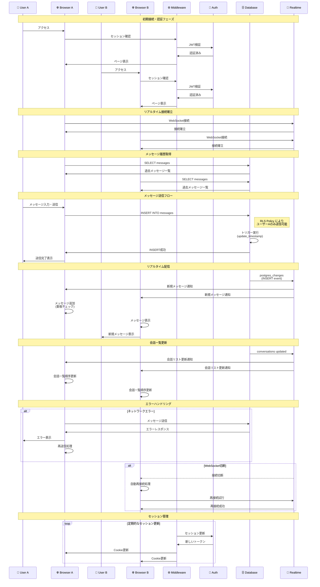

# 💬 チャットメッセージ送信・受信シーケンス図 (3D Enhanced)

Web Chat Systemにおけるリアルタイムチャット機能の詳細なシーケンス図を3D風の立体的に表現しています。

## シーケンス詳細説明

### 1. 初期接続・認証フェーズ

#### ユーザーA・Bのアクセス
1. **ユーザーアクセス**: ユーザーがアプリケーションにアクセス
2. **セッション確認**: Next.js MiddlewareでCookieベースのセッション確認
3. **JWT検証**: Supabase Authで認証トークンの有効性を検証
4. **ページ表示**: 認証済みユーザーにチャットページを表示

### 2. リアルタイム接続確立

#### WebSocket接続
1. **接続開始**: 各ブラウザからSupabase Realtimeへの接続を開始
2. **conversation_id**: 特定の会話IDでチャンネルを購読
3. **接続確立**: WebSocket接続が正常に確立

### 3. メッセージ履歴取得

#### 過去メッセージ読み込み
1. **SQL実行**: `SELECT messages WHERE conversation_id = ?`
2. **RLS適用**: Row Level Securityにより参加者のみアクセス可能
3. **データ取得**: 時系列順でメッセージ一覧を取得

### 4. メッセージ送信フロー

#### メッセージ送信処理
1. **ユーザー入力**: ユーザーAがメッセージを入力・送信
2. **データベース挿入**: `INSERT INTO messages` でメッセージを保存
3. **RLS適用**: ユーザーAのみがメッセージ送信可能
4. **トリガー実行**: `update_conversation_timestamp` で会話の更新日時を自動更新
5. **送信完了**: ブラウザに送信成功を通知

### 5. リアルタイム配信

#### 即座な配信
1. **変更検知**: PostgreSQLの変更をSupabase Realtimeが検知
2. **通知配信**: `postgres_changes` イベントで両ブラウザに通知
3. **メッセージ表示**: 各ブラウザでメッセージを即座に表示
4. **重複チェック**: 送信者側では重複表示を防ぐ処理

### 6. 会話一覧更新

#### 会話順序の更新
1. **timestamp更新**: 会話テーブルの`updated_at`が更新
2. **リスト通知**: 会話一覧に表示順序の変更を通知
3. **順序更新**: 最新の会話が一覧の上位に移動

### 7. エラーハンドリング

#### ネットワークエラー
- **送信失敗**: ネットワーク問題でメッセージ送信失敗
- **エラー表示**: ユーザーにエラーメッセージを表示
- **再送信処理**: 自動または手動での再送信機能

#### WebSocket切断
- **接続切断**: ネットワーク問題等でWebSocket接続が切断
- **自動再接続**: 接続切断を検知して自動的に再接続を試行
- **再接続成功**: 接続が復旧してリアルタイム機能が回復

### 8. セッション管理

#### 定期的な更新
- **セッション更新**: 一定間隔でJWTトークンを更新
- **Cookie更新**: 新しいセッション情報をCookieに保存
- **継続認証**: ユーザーの認証状態を継続的に維持

## 技術的な特徴

### セキュリティ
- **Row Level Security (RLS)**: データベースレベルでのアクセス制御
- **JWT認証**: トークンベースの安全な認証システム
- **セッション管理**: Cookieベースの状態管理

### パフォーマンス
- **インデックス最適化**: 高速なクエリ実行
- **リアルタイム配信**: WebSocketによる低遅延通信
- **自動再接続**: 接続の安定性確保

### スケーラビリティ
- **Supabase infrastructure**: クラウドネイティブなスケーリング
- **効率的な通知**: 必要な参加者のみへの配信
- **データベース最適化**: トリガーによる効率的な更新処理