# コンポーネント構造図

Web Chat Systemのフロントエンドコンポーネント構成と依存関係を示す図です。

```mermaid
graph TD
    %% Web Chat System - コンポーネント構造図
    
    subgraph "App Router (Next.js 15)"
        RootLayout["🏠 layout.tsx<br/>(Root Layout)"]
        HomePage["📄 page.tsx<br/>(Home Page)"]
        
        subgraph "Auth Pages"
            LoginPage["🔑 login/page.tsx"]
            SignUpPage["📝 sign-up/page.tsx"] 
            ForgotPage["❓ forgot-password/page.tsx"]
            ConfirmRoute["✅ confirm/route.ts"]
        end
        
        subgraph "Chat Pages"
            ChatListPage["📋 chat/page.tsx"]
            ChatRoomPage["💬 chat/[id]/page.tsx"]
        end
        
        subgraph "Protected Pages"
            ProtectedLayout["🛡️ protected/layout.tsx"]
            ProtectedPage["🔒 protected/page.tsx"]
        end
    end
    
    subgraph "React Components"
        subgraph "Authentication Components"
            AuthButton["🔐 AuthButton"]
            LoginForm["🔑 LoginForm"]
            SignUpForm["📝 SignUpForm"]
            ForgotForm["❓ ForgotPasswordForm"]
            LogoutButton["🚪 LogoutButton"]
        end
        
        subgraph "Chat Components"
            ChatInterface["💬 ChatInterface"]
            ConversationsList["📋 ConversationsList"]
            DirectMessageInterface["💬 DirectMessageInterface"]
        end
        
        subgraph "UI Components (shadcn/ui)"
            Button["🔘 Button"]
            Input["📝 Input"]
            Card["🃏 Card"]
            Avatar["👤 Avatar"]
            ScrollArea["📜 ScrollArea"]
        end
        
        subgraph "Utility Components"
            ThemeSwitcher["🌙 ThemeSwitcher"]
            EnvWarning["⚠️ EnvVarWarning"]
            Hero["🦸 Hero"]
        end
    end
    
    subgraph "Libraries & Services"
        subgraph "Supabase Integration"
            SupabaseClient["🌐 client.ts"]
            SupabaseServer["🖥️ server.ts"]
            SupabaseMiddleware["⚙️ middleware.ts"]
        end
        
        subgraph "Type Definitions"
            ChatTypes["💬 chat.ts"]
            SupabaseTypes["🗄️ supabase.ts"]
            TypesIndex["📋 index.ts"]
        end
        
        subgraph "Utilities"
            Utils["🛠️ utils.ts"]
            CreateProfile["👤 create-user-profile.ts"]
        end
    end
    
    subgraph "External Dependencies"
        NextJS["⚛️ Next.js 15"]
        React["⚛️ React 19"]
        TypeScript["📘 TypeScript"]
        TailwindCSS["🎨 Tailwind CSS"]
        NextThemes["🌙 next-themes"]
        LucideReact["🎯 Lucide React"]
    end
    
    %% Page to Component Dependencies
    RootLayout --> React
    RootLayout --> NextThemes
    HomePage --> Hero
    
    LoginPage --> LoginForm
    SignUpPage --> SignUpForm
    ForgotPage --> ForgotForm
    
    ChatListPage --> ConversationsList
    ChatRoomPage --> DirectMessageInterface
    
    ProtectedLayout --> AuthButton
    ProtectedPage --> ThemeSwitcher
    
    %% Component Dependencies
    AuthButton --> SupabaseClient
    AuthButton --> Button
    
    LoginForm --> SupabaseClient
    LoginForm --> Button
    LoginForm --> Input
    LoginForm --> Card
    
    SignUpForm --> SupabaseClient  
    SignUpForm --> Button
    SignUpForm --> Input
    SignUpForm --> Card
    
    ConversationsList --> SupabaseClient
    ConversationsList --> ChatTypes
    ConversationsList --> Card
    ConversationsList --> Avatar
    ConversationsList --> Button
    ConversationsList --> Input
    ConversationsList --> ScrollArea
    ConversationsList --> CreateProfile
    
    ChatInterface --> SupabaseClient
    ChatInterface --> ChatTypes
    ChatInterface --> Card
    ChatInterface --> Input
    ChatInterface --> Button
    ChatInterface --> Avatar
    ChatInterface --> ScrollArea
    
    DirectMessageInterface --> SupabaseClient
    DirectMessageInterface --> ChatTypes
    DirectMessageInterface --> Card
    DirectMessageInterface --> Input
    DirectMessageInterface --> Button
    DirectMessageInterface --> Avatar
    DirectMessageInterface --> ScrollArea
    
    ThemeSwitcher --> NextThemes
    ThemeSwitcher --> Button
    
    %% Library Dependencies
    SupabaseClient --> SupabaseTypes
    ChatTypes --> SupabaseTypes
    CreateProfile --> SupabaseClient
    
    %% UI Dependencies
    Button --> React
    Button --> TailwindCSS
    Input --> React
    Input --> TailwindCSS
    Card --> React
    Card --> TailwindCSS
    Avatar --> React
    ScrollArea --> React
    
    %% Icon Dependencies
    AuthButton --> LucideReact
    ConversationsList --> LucideReact
    DirectMessageInterface --> LucideReact
    
    %% Styling
    classDef pageLayer fill:#e3f2fd,stroke:#1565c0,stroke-width:2px
    classDef componentLayer fill:#e8f5e8,stroke:#2e7d32,stroke-width:2px
    classDef libraryLayer fill:#fff3e0,stroke:#ef6c00,stroke-width:2px
    classDef externalLayer fill:#fce4ec,stroke:#ad1457,stroke-width:2px
    
    class RootLayout,HomePage,LoginPage,SignUpPage,ForgotPage,ConfirmRoute,ChatListPage,ChatRoomPage,ProtectedLayout,ProtectedPage pageLayer
    class AuthButton,LoginForm,SignUpForm,ForgotForm,LogoutButton,ChatInterface,ConversationsList,DirectMessageInterface,Button,Input,Card,Avatar,ScrollArea,ThemeSwitcher,EnvWarning,Hero componentLayer
    class SupabaseClient,SupabaseServer,SupabaseMiddleware,ChatTypes,SupabaseTypes,TypesIndex,Utils,CreateProfile libraryLayer
    class NextJS,React,TypeScript,TailwindCSS,NextThemes,LucideReact externalLayer
```

## コンポーネント構造詳細

### 1. App Router (Next.js 15)

#### ルートレイアウト
- **layout.tsx**: アプリケーション全体のレイアウト
  - テーマプロバイダーの設定
  - グローバルスタイルの適用
  - フォント設定

#### ページコンポーネント
- **page.tsx**: ホームページ
  - ランディングページ
  - ナビゲーション要素

#### 認証ページ
- **login/page.tsx**: ログインページ
- **sign-up/page.tsx**: サインアップページ
- **forgot-password/page.tsx**: パスワードリセットページ
- **confirm/route.ts**: メール確認APIルート

#### チャットページ
- **chat/page.tsx**: チャット一覧ページ
- **chat/[id]/page.tsx**: 個別チャットページ

#### 保護されたページ
- **protected/layout.tsx**: 認証が必要なページのレイアウト
- **protected/page.tsx**: 認証済みユーザー向けページ

### 2. React Components

#### 認証コンポーネント
- **AuthButton**: 認証状態に応じたボタン表示
- **LoginForm**: ログインフォーム
- **SignUpForm**: サインアップフォーム
- **ForgotPasswordForm**: パスワードリセットフォーム
- **LogoutButton**: ログアウトボタン

#### チャットコンポーネント
- **ChatInterface**: 公開チャットインターフェース
- **ConversationsList**: 会話一覧表示
- **DirectMessageInterface**: 1対1チャットインターフェース

#### UIコンポーネント (shadcn/ui)
- **Button**: 汎用ボタンコンポーネント
- **Input**: 入力フィールドコンポーネント
- **Card**: カードレイアウトコンポーネント
- **Avatar**: ユーザーアバターコンポーネント
- **ScrollArea**: スクロール可能エリアコンポーネント

#### ユーティリティコンポーネント
- **ThemeSwitcher**: ライト/ダークモード切り替え
- **EnvVarWarning**: 環境変数不足時の警告表示
- **Hero**: ヒーローセクションコンポーネント

### 3. Libraries & Services

#### Supabase統合
- **client.ts**: ブラウザ用Supabaseクライアント
- **server.ts**: サーバー用Supabaseクライアント
- **middleware.ts**: Supabaseミドルウェア設定

#### 型定義
- **chat.ts**: チャット関連の型定義
- **supabase.ts**: Supabaseスキーマ型
- **index.ts**: 型定義のエントリーポイント

#### ユーティリティ
- **utils.ts**: 汎用ユーティリティ関数
- **create-user-profile.ts**: ユーザープロファイル作成機能

### 4. External Dependencies

#### フレームワーク・ライブラリ
- **Next.js 15**: Reactフレームワーク
- **React 19**: UIライブラリ
- **TypeScript**: 型安全なJavaScript

#### スタイリング
- **Tailwind CSS**: ユーティリティファーストCSS
- **next-themes**: テーマ管理
- **Lucide React**: アイコンライブラリ

## 依存関係の説明

### ページからコンポーネントへの依存
1. **認証ページ → 認証コンポーネント**: 各認証ページが対応するフォームコンポーネントを使用
2. **チャットページ → チャットコンポーネント**: チャット機能ページがチャット関連コンポーネントを使用
3. **保護されたページ → 認証コンポーネント**: 認証チェック用のコンポーネントを使用

### コンポーネント間の依存
1. **チャットコンポーネント → UIコンポーネント**: 基本的なUI部品を組み合わせて機能を実現
2. **認証コンポーネント → UIコンポーネント**: フォーム作成にUI部品を使用
3. **すべてのコンポーネント → Supabaseクライアント**: データベース操作とリアルタイム機能

### ライブラリの依存
1. **Supabaseクライアント → 型定義**: データベーススキーマ型を使用
2. **チャット型 → Supabase型**: データベース型を拡張
3. **UIコンポーネント → 外部ライブラリ**: React, Tailwind CSS, アイコンライブラリを使用

## アーキテクチャの特徴

### 関心の分離
- **ページ**: ルーティングと認証チェック
- **コンポーネント**: UI表示とユーザーインタラクション
- **サービス**: データアクセスとビジネスロジック
- **型定義**: データ構造の定義

### 再利用性
- **UIコンポーネント**: 複数の場所で再利用可能
- **認証コンポーネント**: 統一された認証体験
- **型定義**: 一元的な型管理

### 保守性
- **単一責任**: 各コンポーネントが明確な責任を持つ
- **依存関係の最小化**: 必要最小限の依存関係
- **型安全**: TypeScriptによる型チェック

### スケーラビリティ
- **モジュラー設計**: 新機能の追加が容易
- **コンポーネント分割**: 大規模化にも対応
- **レイヤー構造**: 各レイヤーが独立して変更可能