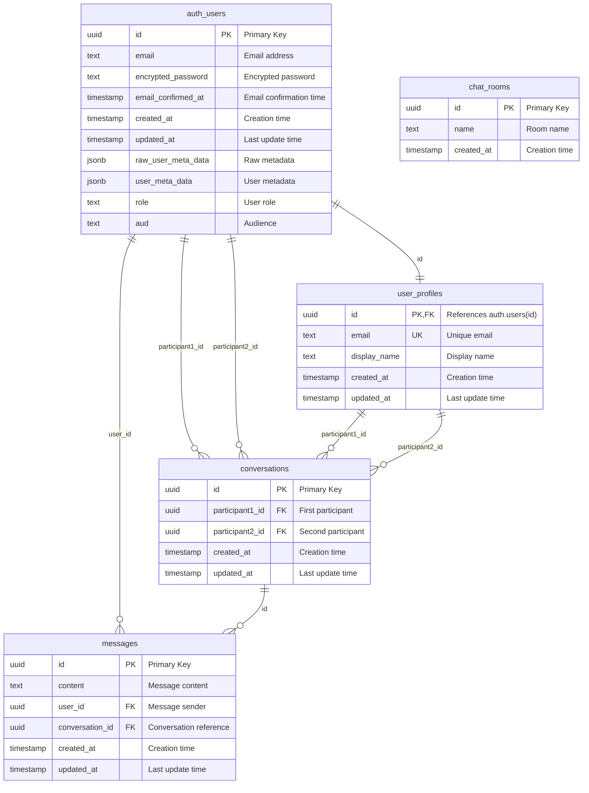

# データベースER図

Web Chat Systemのデータベース設計とテーブル間のリレーションシップを示す図です。



## テーブル定義

### auth.users (Supabase Built-in)
Supabaseが自動的に提供するユーザー認証テーブル

| カラム | 型 | 制約 | 説明 |
|--------|----|----|------|
| id | UUID | PK | ユーザーID（主キー） |
| email | TEXT | | メールアドレス |
| encrypted_password | TEXT | | 暗号化されたパスワード |
| email_confirmed_at | TIMESTAMP | | メール確認日時 |
| created_at | TIMESTAMP | | 作成日時 |
| updated_at | TIMESTAMP | | 更新日時 |
| raw_user_meta_data | JSONB | | 生メタデータ |
| user_meta_data | JSONB | | ユーザーメタデータ |
| role | TEXT | | ユーザーロール |
| aud | TEXT | | オーディエンス |

### user_profiles
ユーザーのプロファイル情報を格納するカスタムテーブル

| カラム | 型 | 制約 | 説明 |
|--------|----|----|------|
| id | UUID | PK, FK | auth.users(id)への外部キー |
| email | TEXT | UNIQUE | メールアドレス（ユニーク） |
| display_name | TEXT | | 表示名 |
| created_at | TIMESTAMP | | 作成日時 |
| updated_at | TIMESTAMP | | 更新日時 |

### conversations
1対1の会話を管理するテーブル

| カラム | 型 | 制約 | 説明 |
|--------|----|----|------|
| id | UUID | PK | 会話ID（主キー） |
| participant1_id | UUID | FK | 参加者1のユーザーID |
| participant2_id | UUID | FK | 参加者2のユーザーID |
| created_at | TIMESTAMP | | 作成日時 |
| updated_at | TIMESTAMP | | 更新日時 |

**制約:**
- `UNIQUE(participant1_id, participant2_id)`: 同じ参加者ペアの重複を防ぐ
- `CHECK(participant1_id != participant2_id)`: 自分自身との会話を防ぐ

### messages
チャットメッセージを格納するテーブル

| カラム | 型 | 制約 | 説明 |
|--------|----|----|------|
| id | UUID | PK | メッセージID（主キー） |
| content | TEXT | NOT NULL | メッセージ内容 |
| user_id | UUID | FK | 送信者のユーザーID |
| conversation_id | UUID | FK | 所属する会話ID |
| created_at | TIMESTAMP | | 作成日時 |
| updated_at | TIMESTAMP | | 更新日時 |

### chat_rooms (将来機能)
グループチャット用のテーブル（現在は未使用）

| カラム | 型 | 制約 | 説明 |
|--------|----|----|------|
| id | UUID | PK | チャットルームID（主キー） |
| name | TEXT | NOT NULL | ルーム名 |
| created_at | TIMESTAMP | | 作成日時 |

## インデックス設計

### conversations
- `idx_conversations_participants`: `(participant1_id, participant2_id)`
- `idx_conversations_updated_at`: `updated_at DESC`
- `idx_conversations_participant1`: `participant1_id`
- `idx_conversations_participant2`: `participant2_id`

### messages
- `idx_messages_created_at`: `created_at DESC`
- `idx_messages_user_id`: `user_id`
- `idx_messages_conversation_id`: `conversation_id`

### user_profiles
- `idx_user_profiles_email`: `email`

## データベース関数

### get_or_create_conversation(user1_id UUID, user2_id UUID)
既存の会話を取得するか、存在しない場合は新規作成する関数

```sql
-- 参加者IDを一貫した順序で並べ替え
-- 既存の会話を検索し、なければ新規作成
RETURNS UUID
```

### update_conversation_timestamp()
メッセージが追加された際に会話のupdated_atを更新するトリガー関数

### update_updated_at_column()
レコード更新時にupdated_atを自動更新するトリガー関数

## Row Level Security (RLS) ポリシー

### user_profiles
- **view own profile**: ユーザーは自分のプロファイルのみ閲覧可能
- **update own profile**: ユーザーは自分のプロファイルのみ更新可能

### conversations
- **view own conversations**: ユーザーは自分が参加する会話のみ閲覧可能
- **create conversations**: ユーザーは自分を含む会話のみ作成可能

### messages
- **view messages in conversations**: ユーザーは自分が参加する会話のメッセージのみ閲覧可能
- **send messages**: ユーザーは自分が参加する会話にのみメッセージ送信可能

## トリガー設定

### 自動プロファイル作成
```sql
-- auth.usersにユーザーが追加された際に自動でuser_profilesを作成
CREATE TRIGGER create_user_profile_trigger
    AFTER INSERT ON auth.users
    FOR EACH ROW
    EXECUTE FUNCTION create_user_profile();
```

### 会話タイムスタンプ更新
```sql
-- メッセージが追加された際に会話のupdated_atを更新
CREATE TRIGGER update_conversation_timestamp_trigger
    AFTER INSERT ON messages
    FOR EACH ROW
    EXECUTE FUNCTION update_conversation_timestamp();
```

### 自動updated_at更新
```sql
-- レコード更新時にupdated_atを自動設定
CREATE TRIGGER update_user_profiles_updated_at
    BEFORE UPDATE ON user_profiles
    FOR EACH ROW
    EXECUTE FUNCTION update_updated_at_column();
```