# システム全体構成図

Web Chat Systemのシステム全体のアーキテクチャを示す図です。

```mermaid
graph TB
    %% Web Chat System - システム構成図
    
    subgraph "User Layer"
        Desktop["🖥️ Desktop User"]
        Mobile["📱 Mobile User"]  
        Tablet["💻 Tablet User"]
    end
    
    subgraph "Frontend Layer"
        subgraph "Browser Environment"
            subgraph "React App"
                Pages["📄 Pages"]
                Components["🧩 Components"]
                Hooks["🪝 Hooks"]
            end
            
            subgraph "Next.js Runtime"
                AppRouter["🛣️ App Router"]
                ServerComponents["⚙️ Server Components"]
                ClientComponents["💻 Client Components"]
            end
            
            subgraph "UI Libraries"
                ShadcnUI["🎨 shadcn/ui"]
                TailwindCSS["🎨 Tailwind CSS"]
                LucideIcons["🎯 Lucide Icons"]
            end
        end
    end
    
    subgraph "Middleware Layer"
        subgraph "Next.js Middleware"
            SessionMgmt["🔐 Session Management"]
            RouteProtection["🛡️ Route Protection"]
        end
        
        subgraph "Supabase Client"
            BrowserClient["🌐 Browser Client"]
            ServerClient["🖥️ Server Client"]
        end
        
        subgraph "Theme Provider"
            DarkMode["🌙 Dark Mode"]
            SystemTheme["⚙️ System Theme"]
        end
    end
    
    subgraph "Backend Layer (Supabase)"
        subgraph "Authentication"
            JWTAuth["🔑 JWT Auth"]
            UserMgmt["👤 User Management"]
            SessionStore["💾 Session Store"]
        end
        
        subgraph "Database"
            PostgreSQL[("🗄️ PostgreSQL")]
            PostgRESTAPI["🔗 PostgREST API"]
            subgraph "Database Components"
                Tables["📊 Tables"]
                Functions["⚙️ Functions"]
                Triggers["⚡ Triggers"]
                RLSPolicies["🔒 RLS Policies"]
            end
        end
        
        subgraph "Realtime"
            WebSocketServer["📡 WebSocket Server"]
            PubSub["📢 Pub/Sub"]
            ChangeDetection["🔍 Change Detection"]
        end
        
        subgraph "Storage"
            FileStorage["📁 File Storage"]
            CDN["🌍 CDN"]
        end
    end
    
    %% Connections
    Desktop --> Pages
    Mobile --> Pages
    Tablet --> Pages
    
    Pages --> AppRouter
    Components --> ShadcnUI
    Components --> TailwindCSS
    Components --> LucideIcons
    
    AppRouter --> SessionMgmt
    AppRouter --> RouteProtection
    
    BrowserClient --> JWTAuth
    BrowserClient --> PostgreSQL
    BrowserClient --> WebSocketServer
    
    ServerClient --> PostgreSQL
    
    JWTAuth --> UserMgmt
    PostgreSQL --> Tables
    PostgreSQL --> Functions
    PostgreSQL --> Triggers
    PostgreSQL --> RLSPolicies
    
    WebSocketServer --> PubSub
    WebSocketServer --> ChangeDetection
    
    PostgRESTAPI --> PostgreSQL
    
    %% Styling
    classDef userLayer fill:#e1f5fe
    classDef frontendLayer fill:#e8f5e8  
    classDef middlewareLayer fill:#fff9c4
    classDef backendLayer fill:#ffebee
    
    class Desktop,Mobile,Tablet userLayer
    class Pages,Components,Hooks,AppRouter,ServerComponents,ClientComponents,ShadcnUI,TailwindCSS,LucideIcons frontendLayer
    class SessionMgmt,RouteProtection,BrowserClient,ServerClient,DarkMode,SystemTheme middlewareLayer
    class JWTAuth,UserMgmt,SessionStore,PostgreSQL,PostgRESTAPI,Tables,Functions,Triggers,RLSPolicies,WebSocketServer,PubSub,ChangeDetection,FileStorage,CDN backendLayer
```

## 構成要素

### User Layer
- **Desktop User**: デスクトップブラウザからのアクセス
- **Mobile User**: モバイルブラウザからのアクセス
- **Tablet User**: タブレットブラウザからのアクセス

### Frontend Layer
#### React App
- **Pages**: Next.js App Routerによるページコンポーネント
- **Components**: 再利用可能なUIコンポーネント
- **Hooks**: カスタムReactフック

#### Next.js Runtime
- **App Router**: Next.js 15の新しいルーティングシステム
- **Server Components**: サーバーサイドレンダリングコンポーネント
- **Client Components**: クライアントサイドコンポーネント

#### UI Libraries
- **shadcn/ui**: モダンなUIコンポーネントライブラリ
- **Tailwind CSS**: ユーティリティファーストCSSフレームワーク
- **Lucide Icons**: アイコンライブラリ

### Middleware Layer
#### Next.js Middleware
- **Session Management**: ユーザーセッションの管理
- **Route Protection**: ルートアクセス制御

#### Supabase Client
- **Browser Client**: ブラウザ用Supabaseクライアント
- **Server Client**: サーバー用Supabaseクライアント

#### Theme Provider
- **Dark Mode**: ダークモード機能
- **System Theme**: システムテーマ検出

### Backend Layer (Supabase)
#### Authentication
- **JWT Auth**: JWT認証システム
- **User Management**: ユーザー管理
- **Session Store**: セッション保存

#### Database
- **PostgreSQL**: メインデータベース
- **PostgREST API**: 自動生成REST API
- **Database Components**: テーブル、関数、トリガー、RLSポリシー

#### Realtime
- **WebSocket Server**: リアルタイム通信サーバー
- **Pub/Sub**: パブリッシュ/サブスクライブ機能
- **Change Detection**: データ変更検知

#### Storage
- **File Storage**: ファイル保存機能
- **CDN**: コンテンツ配信ネットワーク

## データフロー

1. **ユーザーアクセス**: 各デバイスからブラウザ経由でアクセス
2. **フロントエンド処理**: React Appでページとコンポーネントを表示
3. **ミドルウェア処理**: セッション管理とルート保護
4. **バックエンド処理**: 認証、データベース操作、リアルタイム通信
5. **レスポンス**: バックエンドからフロントエンドにデータを返却