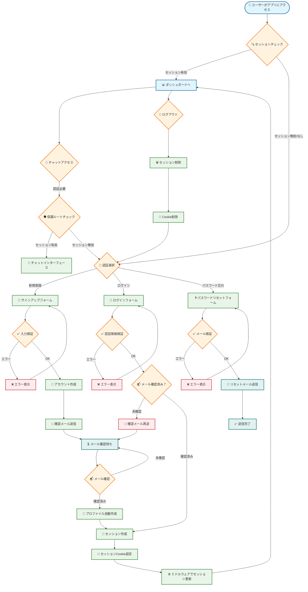
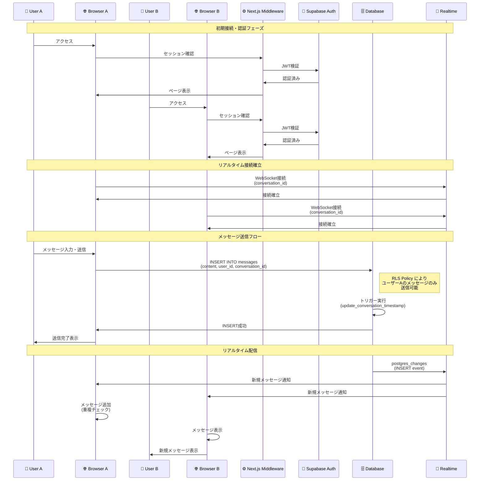

# 要件定義書

## 1. プロジェクト概要

### 1.1 プロジェクト名
**Web Chat Application**

### 1.2 目的
リアルタイムでのコミュニケーションを可能にするWebベースのチャットアプリケーションを開発し、ユーザー間のスムーズなメッセージング体験を提供する。

### 1.3 対象ユーザー
- 個人間でのプライベートなコミュニケーションを求めるユーザー
- リアルタイム性を重視するユーザー
- シンプルで使いやすいインターフェースを求めるユーザー

### 1.4 プロジェクトスコープ
- 1対1のプライベートチャット機能
- リアルタイムメッセージング
- ユーザー認証・管理
- レスポンシブデザイン
- 将来的なグループチャット機能への拡張性

## Mermaid 図表

本要件定義書に関連するMermaid図表：

### 認証フロー図

### チャットシーケンス図

> **Note**: これらの図表はGitHub上で自動的に表示されます。  
> ソースファイル: [`docs/archi/diagrams/`](./diagrams/) ディレクトリ内

## 2. 機能要件

### 2.1 認証機能

#### 2.1.1 ユーザー登録
- **FR-001**: ユーザーはメールアドレスとパスワードでアカウントを作成できる
- **FR-002**: 登録時にメール確認が必要
- **FR-003**: 表示名を設定できる（オプション）
- **FR-004**: 登録完了後、自動的にユーザープロファイルが作成される

#### 2.1.2 ユーザーログイン
- **FR-005**: ユーザーはメールアドレスとパスワードでログインできる
- **FR-006**: ログイン状態が保持される（セッション管理）
- **FR-007**: ログアウト機能が提供される

#### 2.1.3 パスワード管理
- **FR-008**: パスワードリセット機能が提供される
- **FR-009**: パスワード変更機能が提供される
- **FR-010**: パスワードの強度チェックが実装される

### 2.2 ユーザー管理機能

#### 2.2.1 プロファイル管理
- **FR-011**: ユーザーは自分のプロファイル情報を表示できる
- **FR-012**: ユーザーは表示名を変更できる
- **FR-013**: ユーザーは自分のメールアドレスを確認できる

#### 2.2.2 ユーザー検索
- **FR-014**: ユーザーは他のユーザーをメールアドレスで検索できる
- **FR-015**: 検索結果は部分一致で表示される
- **FR-016**: 自分自身は検索結果に表示されない

### 2.3 チャット機能

#### 2.3.1 会話管理
- **FR-017**: ユーザーは他のユーザーとの1対1会話を開始できる
- **FR-018**: 既存の会話が存在する場合、新しい会話は作成されない
- **FR-019**: 会話一覧が最新の活動順で表示される
- **FR-020**: 会話に参加している相手のユーザー情報が表示される

#### 2.3.2 メッセージ送信
- **FR-021**: ユーザーはテキストメッセージを送信できる
- **FR-022**: 送信したメッセージは即座に画面に反映される
- **FR-023**: メッセージの送信時刻が表示される
- **FR-024**: 空のメッセージは送信できない

#### 2.3.3 メッセージ受信
- **FR-025**: 新しいメッセージはリアルタイムで受信される
- **FR-026**: 受信したメッセージは自動的に画面に表示される
- **FR-027**: メッセージの送信者が識別できる
- **FR-028**: メッセージの受信時刻が表示される

#### 2.3.4 メッセージ表示
- **FR-029**: メッセージは時系列順で表示される
- **FR-030**: 自分のメッセージと相手のメッセージが区別して表示される
- **FR-031**: 新しいメッセージが追加されると自動的に下部にスクロールする
- **FR-032**: 過去のメッセージ履歴が表示される

### 2.4 リアルタイム機能

#### 2.4.1 リアルタイム通信
- **FR-033**: メッセージの送受信がリアルタイムで行われる
- **FR-034**: 複数のユーザーが同時にメッセージを送信できる
- **FR-035**: ネットワーク接続の断絶時に自動的に再接続される
- **FR-036**: 接続状態がユーザーに通知される

### 2.5 ユーザーインターフェース

#### 2.5.1 レスポンシブデザイン
- **FR-037**: デスクトップブラウザで適切に表示される
- **FR-038**: モバイルデバイスで適切に表示される
- **FR-039**: タブレットデバイスで適切に表示される

#### 2.5.2 テーマ機能
- **FR-040**: ライトテーマとダークテーマの切り替えが可能
- **FR-041**: システムの設定に応じて自動的にテーマが選択される
- **FR-042**: テーマの設定が保持される

#### 2.5.3 ナビゲーション
- **FR-043**: 直感的なナビゲーションが提供される
- **FR-044**: 現在の画面位置が分かりやすく表示される
- **FR-045**: 戻る・進む操作が可能

## 3. 非機能要件

### 3.1 性能要件

#### 3.1.1 応答時間
- **NFR-001**: ページの初回読み込み時間は3秒以内
- **NFR-002**: メッセージの送信から表示までの時間は1秒以内
- **NFR-003**: ユーザー検索結果の表示は2秒以内

#### 3.1.2 スループット
- **NFR-004**: 同時に100人のユーザーがアクセスできる
- **NFR-005**: 1秒間に1000件のメッセージを処理できる

#### 3.1.3 リアルタイム性
- **NFR-006**: メッセージの配信遅延は500ms以内
- **NFR-007**: リアルタイム接続の確立時間は3秒以内

### 3.2 可用性要件

#### 3.2.1 システム稼働率
- **NFR-008**: システムの稼働率は99.9%以上
- **NFR-009**: 計画停止時間は月間4時間以内

#### 3.2.2 障害対応
- **NFR-010**: 障害発生時の復旧時間は1時間以内
- **NFR-011**: データの損失は発生しない

### 3.3 セキュリティ要件

#### 3.3.1 認証・認可
- **NFR-012**: すべてのAPIエンドポイントで認証が必要
- **NFR-013**: ユーザーは自分のデータのみアクセス可能
- **NFR-014**: セッションの有効期限は適切に管理される

#### 3.3.2 データ保護
- **NFR-015**: パスワードはハッシュ化して保存される
- **NFR-016**: 通信は HTTPS で暗号化される
- **NFR-017**: 機密情報はログに出力されない

#### 3.3.3 プライバシー
- **NFR-018**: ユーザーの個人情報は適切に保護される
- **NFR-019**: 不正なアクセスは検知・防止される
- **NFR-020**: データの不正な改ざんは防止される

### 3.4 保守性要件

#### 3.4.1 コード品質
- **NFR-021**: TypeScript による型安全性が確保される
- **NFR-022**: ESLint によるコード品質チェックが実装される
- **NFR-023**: 単体テストのカバレッジは80%以上

#### 3.4.2 ドキュメント
- **NFR-024**: APIドキュメントが整備される
- **NFR-025**: システム設計書が整備される
- **NFR-026**: 運用マニュアルが整備される

### 3.5 運用要件

#### 3.5.1 監視
- **NFR-027**: システムの動作状況が監視される
- **NFR-028**: エラーログが適切に記録される
- **NFR-029**: パフォーマンス指標が測定される

#### 3.5.2 バックアップ
- **NFR-030**: データベースの定期バックアップが実行される
- **NFR-031**: バックアップからの復旧が可能

## 4. 技術要件

### 4.1 フロントエンド技術

#### 4.1.1 基盤技術
- **TR-001**: Next.js 15 (App Router) を使用
- **TR-002**: React 19 を使用
- **TR-003**: TypeScript を使用
- **TR-004**: Tailwind CSS を使用

#### 4.1.2 UI/UX
- **TR-005**: shadcn/ui コンポーネントを使用
- **TR-006**: Lucide React アイコンを使用
- **TR-007**: next-themes でテーマ切り替えを実装

### 4.2 バックエンド技術

#### 4.2.1 認証・データベース
- **TR-008**: Supabase を BaaS として使用
- **TR-009**: PostgreSQL をデータベースとして使用
- **TR-010**: Row Level Security (RLS) を実装

#### 4.2.2 リアルタイム機能
- **TR-011**: Supabase Realtime を使用
- **TR-012**: WebSocket による双方向通信を実装

### 4.3 開発・運用技術

#### 4.3.1 開発環境
- **TR-013**: Bun をパッケージマネージャーとして使用
- **TR-014**: Turbopack を開発サーバーとして使用
- **TR-015**: ESLint でコード品質を管理

#### 4.3.2 デプロイ・ホスティング
- **TR-016**: Vercel または同等のプラットフォームで本番環境を構築
- **TR-017**: CDN によるコンテンツ配信最適化
- **TR-018**: 自動デプロイメントパイプラインを構築

## 5. 制約事項

### 5.1 技術制約

#### 5.1.1 プラットフォーム制約
- **C-001**: モダンブラウザ（Chrome 90+、Firefox 88+、Safari 14+）のサポート
- **C-002**: JavaScript が有効な環境での動作
- **C-003**: WebSocket をサポートする環境での動作

#### 5.1.2 外部サービス依存
- **C-004**: Supabase サービスの可用性に依存
- **C-005**: インターネット接続が必要

### 5.2 機能制約

#### 5.2.1 チャット機能制約
- **C-006**: 現在は1対1チャットのみサポート
- **C-007**: テキストメッセージのみサポート（画像・ファイル添付は未対応）
- **C-008**: メッセージの編集・削除機能は未実装

#### 5.2.2 データ制約
- **C-009**: メッセージの最大長は1000文字
- **C-010**: ユーザー名の最大長は50文字
- **C-011**: 同時接続ユーザー数の上限は100人

### 5.3 セキュリティ制約

#### 5.3.1 認証制約
- **C-012**: パスワードの最小長は8文字
- **C-013**: セッションの最大有効期限は24時間
- **C-014**: 同一IPからの連続ログイン試行は制限される

## 6. 前提条件

### 6.1 技術前提

#### 6.1.1 開発環境
- **P-001**: Node.js 18+ がインストールされている
- **P-002**: Bun がインストールされている
- **P-003**: Git がインストールされている
- **P-004**: Supabase アカウントが作成済み

#### 6.1.2 実行環境
- **P-005**: モダンブラウザが使用できる環境
- **P-006**: インターネット接続が可能な環境
- **P-007**: HTTPS 対応のWebサーバー環境

### 6.2 運用前提

#### 6.2.1 データ管理
- **P-008**: データベースのバックアップ体制が整備されている
- **P-009**: 法的要件に応じたデータ保持期間が設定されている
- **P-010**: GDPR等のプライバシー法令への対応が実施されている

#### 6.2.2 サポート体制
- **P-011**: 技術サポート体制が整備されている
- **P-012**: 緊急時の対応体制が整備されている
- **P-013**: 定期的なシステム更新が実施される

## 7. 将来拡張計画

### 7.1 短期拡張計画（3ヶ月以内）

#### 7.1.1 基本機能拡張
- **FE-001**: メッセージの既読・未読状態表示
- **FE-002**: ユーザーのオンライン状態表示
- **FE-003**: メッセージの編集・削除機能

#### 7.1.2 UI/UX改善
- **FE-004**: 絵文字リアクション機能
- **FE-005**: メッセージの検索機能
- **FE-006**: 通知機能の追加

### 7.2 中期拡張計画（6ヶ月以内）

#### 7.2.1 グループチャット機能
- **FE-007**: グループチャットの作成・管理
- **FE-008**: グループメンバーの追加・削除
- **FE-009**: グループ管理者権限の実装

#### 7.2.2 メディア機能
- **FE-010**: 画像ファイルの送信・表示
- **FE-011**: ファイル添付機能
- **FE-012**: 音声メッセージ機能

### 7.3 長期拡張計画（12ヶ月以内）

#### 7.3.1 高度な機能
- **FE-013**: ビデオ通話機能
- **FE-014**: 画面共有機能
- **FE-015**: メッセージの暗号化

#### 7.3.2 プラットフォーム拡張
- **FE-016**: モバイルアプリ版の開発
- **FE-017**: デスクトップアプリ版の開発
- **FE-018**: API の公開

## 8. 品質保証

### 8.1 テスト要件

#### 8.1.1 単体テスト
- **QA-001**: 全てのコンポーネントで単体テストを実装
- **QA-002**: テストカバレッジ80%以上を維持
- **QA-003**: 自動化されたテストの実行

#### 8.1.2 統合テスト
- **QA-004**: API エンドポイントの統合テスト
- **QA-005**: データベース操作の統合テスト
- **QA-006**: リアルタイム機能の統合テスト

#### 8.1.3 E2Eテスト
- **QA-007**: 主要なユーザーシナリオのE2Eテスト
- **QA-008**: 複数ブラウザでのクロスブラウザテスト
- **QA-009**: モバイルデバイスでの動作テスト

### 8.2 性能テスト

#### 8.2.1 負荷テスト
- **QA-010**: 同時接続ユーザー数の負荷テスト
- **QA-011**: メッセージ送信の負荷テスト
- **QA-012**: データベースクエリの性能テスト

#### 8.2.2 ストレステスト
- **QA-013**: 最大負荷時の動作確認
- **QA-014**: 障害発生時の復旧テスト
- **QA-015**: メモリリークの検査

### 8.3 セキュリティテスト

#### 8.3.1 脆弱性テスト
- **QA-016**: SQL インジェクション攻撃の対策確認
- **QA-017**: XSS 攻撃の対策確認
- **QA-018**: CSRF 攻撃の対策確認

#### 8.3.2 認証テスト
- **QA-019**: 不正アクセスの防止確認
- **QA-020**: セッションハイジャック対策確認
- **QA-021**: 権限昇格攻撃の対策確認

## 9. プロジェクト管理

### 9.1 開発体制

#### 9.1.1 役割分担
- **PM-001**: プロジェクトマネージャー1名
- **PM-002**: フロントエンド開発者1-2名
- **PM-003**: バックエンド開発者1名
- **PM-004**: QAエンジニア1名

#### 9.1.2 開発プロセス
- **PM-005**: アジャイル開発手法を採用
- **PM-006**: 2週間のスプリントで開発
- **PM-007**: 継続的インテグレーション・デプロイメント

### 9.2 スケジュール

#### 9.2.1 開発フェーズ
- **Phase 1**: 基本設計・環境構築（2週間）
- **Phase 2**: 認証機能実装（2週間）
- **Phase 3**: チャット機能実装（4週間）
- **Phase 4**: UI/UX改善・テスト（2週間）
- **Phase 5**: 本番リリース準備（1週間）

#### 9.2.2 マイルストーン
- **M-001**: 基本設計完了
- **M-002**: 認証機能完了
- **M-003**: チャット機能完了
- **M-004**: β版リリース
- **M-005**: 本番リリース

## 10. リスク管理

### 10.1 技術リスク

#### 10.1.1 依存技術リスク
- **R-001**: Supabase サービスの障害・仕様変更
- **R-002**: Next.js の重大な不具合・破壊的変更
- **R-003**: リアルタイム機能の性能問題

#### 10.1.2 対策
- **R-004**: 代替技術の調査・検討
- **R-005**: 障害時の対応手順の整備
- **R-006**: 定期的な依存関係の更新

### 10.2 プロジェクトリスク

#### 10.2.1 スケジュールリスク
- **R-007**: 開発工数の見積もり不足
- **R-008**: 仕様変更による開発遅延
- **R-009**: 品質問題による修正工数増加

#### 10.2.2 対策
- **R-010**: バッファ期間の設定
- **R-011**: 段階的リリースの実施
- **R-012**: 定期的な進捗確認・調整

### 10.3 運用リスク

#### 10.3.1 セキュリティリスク
- **R-013**: 不正アクセス・データ漏洩
- **R-014**: DDoS 攻撃による障害
- **R-015**: 脆弱性の発見・悪用

#### 10.3.2 対策
- **R-016**: セキュリティ監査の実施
- **R-017**: 緊急時対応手順の整備
- **R-018**: 定期的なセキュリティ更新

## 11. 承認

### 11.1 要件承認

#### 11.1.1 承認者
- **プロジェクトマネージャー**: [名前]
- **技術リーダー**: [名前]
- **プロダクトオーナー**: [名前]

#### 11.1.2 承認日
- **要件定義承認日**: [日付]
- **技術仕様承認日**: [日付]
- **最終承認日**: [日付]

### 11.2 変更管理

#### 11.2.1 変更プロセス
- **CH-001**: 要件変更は承認者の合意が必要
- **CH-002**: 変更内容は文書化・履歴管理
- **CH-003**: 影響範囲・工数の評価を実施

#### 11.2.2 変更履歴
- **v1.0**: 初版作成 [日付]
- **v1.1**: [変更内容] [日付]
- **v1.2**: [変更内容] [日付]

---

**文書作成日**: 2025-01-06  
**最終更新日**: 2025-01-06  
**文書バージョン**: 1.0  
**作成者**: Claude Code  
**承認者**: [承認者名]