# システム構成図

## 概要
リアルタイムチャット機能を持つWebアプリケーション。Next.js 15のApp RouterとSupabase認証・データベース・リアルタイム機能を使用。

## Mermaid システム構成図

```mermaid
graph TB
    %% Web Chat System - システム構成図
    
    subgraph "User Layer"
        Desktop["🖥️ Desktop User"]
        Mobile["📱 Mobile User"]  
        Tablet["💻 Tablet User"]
    end
    
    subgraph "Frontend Layer"
        subgraph "Browser Environment"
            subgraph "React App"
                Pages["📄 Pages"]
                Components["🧩 Components"]
                Hooks["🪝 Hooks"]
            end
            
            subgraph "Next.js Runtime"
                AppRouter["🛣️ App Router"]
                ServerComponents["⚙️ Server Components"]
                ClientComponents["💻 Client Components"]
            end
            
            subgraph "UI Libraries"
                ShadcnUI["🎨 shadcn/ui"]
                TailwindCSS["🎨 Tailwind CSS"]
                LucideIcons["🎯 Lucide Icons"]
            end
        end
    end
    
    subgraph "Middleware Layer"
        subgraph "Next.js Middleware"
            SessionMgmt["🔐 Session Management"]
            RouteProtection["🛡️ Route Protection"]
        end
        
        subgraph "Supabase Client"
            BrowserClient["🌐 Browser Client"]
            ServerClient["🖥️ Server Client"]
        end
        
        subgraph "Theme Provider"
            DarkMode["🌙 Dark Mode"]
            SystemTheme["⚙️ System Theme"]
        end
    end
    
    subgraph "Backend Layer (Supabase)"
        subgraph "Authentication"
            JWTAuth["🔑 JWT Auth"]
            UserMgmt["👤 User Management"]
            SessionStore["💾 Session Store"]
        end
        
        subgraph "Database"
            PostgreSQL[("🗄️ PostgreSQL")]
            PostgRESTAPI["🔗 PostgREST API"]
            subgraph "Database Components"
                Tables["📊 Tables"]
                Functions["⚙️ Functions"]
                Triggers["⚡ Triggers"]
                RLSPolicies["🔒 RLS Policies"]
            end
        end
        
        subgraph "Realtime"
            WebSocketServer["📡 WebSocket Server"]
            PubSub["📢 Pub/Sub"]
            ChangeDetection["🔍 Change Detection"]
        end
        
        subgraph "Storage"
            FileStorage["📁 File Storage"]
            CDN["🌍 CDN"]
        end
    end
    
    %% Connections
    Desktop --> Pages
    Mobile --> Pages
    Tablet --> Pages
    
    Pages --> AppRouter
    Components --> ShadcnUI
    Components --> TailwindCSS
    Components --> LucideIcons
    
    AppRouter --> SessionMgmt
    AppRouter --> RouteProtection
    
    BrowserClient --> JWTAuth
    BrowserClient --> PostgreSQL
    BrowserClient --> WebSocketServer
    
    ServerClient --> PostgreSQL
    
    JWTAuth --> UserMgmt
    PostgreSQL --> Tables
    PostgreSQL --> Functions
    PostgreSQL --> Triggers
    PostgreSQL --> RLSPolicies
    
    WebSocketServer --> PubSub
    WebSocketServer --> ChangeDetection
    
    PostgRESTAPI --> PostgreSQL
    
    %% Styling
    classDef userLayer fill:#e1f5fe
    classDef frontendLayer fill:#e8f5e8  
    classDef middlewareLayer fill:#fff9c4
    classDef backendLayer fill:#ffebee
    
    class Desktop,Mobile,Tablet userLayer
    class Pages,Components,Hooks,AppRouter,ServerComponents,ClientComponents,ShadcnUI,TailwindCSS,LucideIcons frontendLayer
    class SessionMgmt,RouteProtection,BrowserClient,ServerClient,DarkMode,SystemTheme middlewareLayer
    class JWTAuth,UserMgmt,SessionStore,PostgreSQL,PostgRESTAPI,Tables,Functions,Triggers,RLSPolicies,WebSocketServer,PubSub,ChangeDetection,FileStorage,CDN backendLayer
```



> **Note**: この図表はGitHub上で自動的に表示されます。  
> ソースファイル: [`docs/archi/diagrams/system-architecture.mmd`](./diagrams/system-architecture.mmd)

## システム構成

```
┌─────────────────────────────────────────────────────────────────────────┐
│                            Web Chat System                             │
├─────────────────────────────────────────────────────────────────────────┤
│                                                                         │
│  ┌──────────────────────────────────────────────────────────────────┐   │
│  │                      Frontend Layer                             │   │
│  │                                                                  │   │
│  │  ┌────────────────┐  ┌────────────────┐  ┌────────────────┐   │   │
│  │  │   Auth Pages   │  │   Chat Pages   │  │   Protected    │   │   │
│  │  │                │  │                │  │    Pages       │   │   │
│  │  │  /auth/login   │  │  /chat         │  │  /protected    │   │   │
│  │  │  /auth/sign-up │  │  /chat/[id]    │  │                │   │   │
│  │  │  /auth/forgot  │  │                │  │                │   │   │
│  │  └────────────────┘  └────────────────┘  └────────────────┘   │   │
│  │                                                                  │   │
│  │  ┌────────────────────────────────────────────────────────────┐   │   │
│  │  │                   Components                               │   │   │
│  │  │                                                            │   │   │
│  │  │  ┌─────────────────┐  ┌─────────────────┐  ┌─────────────┐ │   │   │
│  │  │  │ChatInterface    │  │ConversationsList│  │DirectMessage│ │   │   │
│  │  │  │(公開チャット)   │  │(会話一覧)        │  │Interface    │ │   │   │
│  │  │  └─────────────────┘  └─────────────────┘  └─────────────┘ │   │   │
│  │  │                                                            │   │   │
│  │  │  ┌─────────────────┐  ┌─────────────────┐  ┌─────────────┐ │   │   │
│  │  │  │AuthButton       │  │ThemeSwitcher    │  │UI Components│ │   │   │
│  │  │  │(認証ボタン)     │  │(テーマ切替)     │  │(shadcn/ui)  │ │   │   │
│  │  │  └─────────────────┘  └─────────────────┘  └─────────────┘ │   │   │
│  │  └────────────────────────────────────────────────────────────┘   │   │
│  └──────────────────────────────────────────────────────────────────┘   │
│                                                                         │
│  ┌──────────────────────────────────────────────────────────────────┐   │
│  │                      Middleware Layer                           │   │
│  │                                                                  │   │
│  │  ┌────────────────┐  ┌────────────────┐  ┌────────────────┐   │   │
│  │  │   Next.js      │  │   Supabase     │  │   Theme        │   │   │
│  │  │   Middleware   │  │   Middleware   │  │   Provider     │   │   │
│  │  │                │  │                │  │                │   │   │
│  │  │  - セッション   │  │  - セッション   │  │  - ダークモード │   │   │
│  │  │    管理        │  │    更新        │  │  - システム     │   │   │
│  │  │  - ルート      │  │  - Cookie      │  │    テーマ      │   │   │
│  │  │    保護        │  │    ハンドリング │  │    検出        │   │   │
│  │  └────────────────┘  └────────────────┘  └────────────────┘   │   │
│  └──────────────────────────────────────────────────────────────────┘   │
│                                                                         │
│  ┌──────────────────────────────────────────────────────────────────┐   │
│  │                      Backend Layer                              │   │
│  │                                                                  │   │
│  │  ┌──────────────────────────────────────────────────────────────┐   │   │
│  │  │                     Supabase                                │   │   │
│  │  │                                                              │   │   │
│  │  │  ┌────────────────┐  ┌────────────────┐  ┌────────────────┐ │   │   │
│  │  │  │   Auth         │  │   Database     │  │   Realtime     │ │   │   │
│  │  │  │                │  │                │  │                │ │   │   │
│  │  │  │  - ユーザー    │  │  - PostgreSQL  │  │  - WebSocket   │ │   │   │
│  │  │  │    認証        │  │  - PostgREST   │  │  - Real-time   │ │   │   │
│  │  │  │  - セッション  │  │  - RLS         │  │    subscription│ │   │   │
│  │  │  │    管理        │  │  - Database    │  │  - Postgres    │ │   │   │
│  │  │  │  - JWT トークン│  │    functions   │  │    changes     │ │   │   │
│  │  │  └────────────────┘  └────────────────┘  └────────────────┘ │   │   │
│  │  └──────────────────────────────────────────────────────────────┘   │   │
│  └──────────────────────────────────────────────────────────────────┘   │
│                                                                         │
│  ┌──────────────────────────────────────────────────────────────────┐   │
│  │                      Database Schema                            │   │
│  │                                                                  │   │
│  │  ┌────────────────┐  ┌────────────────┐  ┌────────────────┐   │   │
│  │  │  user_profiles │  │  conversations │  │    messages    │   │   │
│  │  │                │  │                │  │                │   │   │
│  │  │  - id (UUID)   │  │  - id (UUID)   │  │  - id (UUID)   │   │   │
│  │  │  - email       │  │  - participant1│  │  - content     │   │   │
│  │  │  - display_name│  │  - participant2│  │  - user_id     │   │   │
│  │  │  - created_at  │  │  - created_at  │  │  - conv_id     │   │   │
│  │  │  - updated_at  │  │  - updated_at  │  │  - created_at  │   │   │
│  │  └────────────────┘  └────────────────┘  └────────────────┘   │   │
│  │                                                                  │   │
│  │  ┌────────────────┐  ┌────────────────┐  ┌────────────────┐   │   │
│  │  │  auth.users    │  │  chat_rooms    │  │   Functions    │   │   │
│  │  │  (Supabase     │  │  (将来機能)    │  │                │   │   │
│  │  │   built-in)    │  │                │  │  - get_or_     │   │   │
│  │  │                │  │  - id (UUID)   │  │    create_     │   │   │
│  │  │  - id (UUID)   │  │  - name        │  │    conversation│   │   │
│  │  │  - email       │  │  - created_at  │  │  - update_     │   │   │
│  │  │  - password    │  │                │  │    conversation│   │   │
│  │  │  - created_at  │  │                │  │    _timestamp  │   │   │
│  │  └────────────────┘  └────────────────┘  └────────────────┘   │   │
│  └──────────────────────────────────────────────────────────────────┘   │
└─────────────────────────────────────────────────────────────────────────┘
```

## 技術スタック

### Frontend
- **Next.js 15** - App Router、Server Components、Client Components
- **React 19** - UIライブラリ
- **TypeScript** - 型安全性
- **Tailwind CSS** - スタイリング
- **shadcn/ui** - UIコンポーネント
- **next-themes** - テーマ切替機能
- **Lucide React** - アイコン

### Backend
- **Supabase** - BaaS (Backend as a Service)
  - **認証システム** - JWT トークンベース
  - **PostgreSQL** - データベース
  - **PostgREST** - 自動生成API
  - **Realtime** - リアルタイム機能
  - **Row Level Security (RLS)** - データアクセス制御

### パッケージマネージャー
- **Bun** - 高速なJavaScriptランタイム・パッケージマネージャー

## データフロー

### 認証フロー
1. ユーザーがログインフォームに入力
2. Supabase Authで認証処理
3. JWT トークンがCookieに保存
4. Middlewareでセッション管理
5. 保護されたルートへのアクセス制御

### チャットフロー
1. ユーザーが会話一覧を閲覧
2. 新しいチャットを開始または既存の会話を選択
3. リアルタイムでメッセージを送受信
4. Supabase Realtimeで即座に他のユーザーに配信
5. メッセージはPostgreSQLに永続化

## セキュリティ

### 認証・認可
- Supabase Auth によるセキュアな認証
- Row Level Security (RLS) によるデータアクセス制御
- JWT トークンによるセッション管理

### データ保護
- 会話の参加者のみがメッセージを閲覧可能
- ユーザーは自分の参加する会話のみアクセス可能
- サーバーサイドでの権限チェック

## スケーラビリティ

### パフォーマンス
- Server Components による効率的なレンダリング
- データベースインデックスによる高速クエリ
- Realtime subscriptionによる効率的なリアルタイム通信

### 拡張性
- モジュラー設計による機能追加の容易さ
- Type-safeなAPI設計
- 将来のグループチャット機能への拡張を考慮した設計

## 運用・監視

### 開発環境
- Turbopack による高速な開発サーバー
- TypeScript による型チェック
- ESLint による静的解析
- Prettier による自動フォーマット

### 本番環境
- Next.js のビルド最適化
- Supabase による自動スケーリング
- CDN によるコンテンツ配信最適化