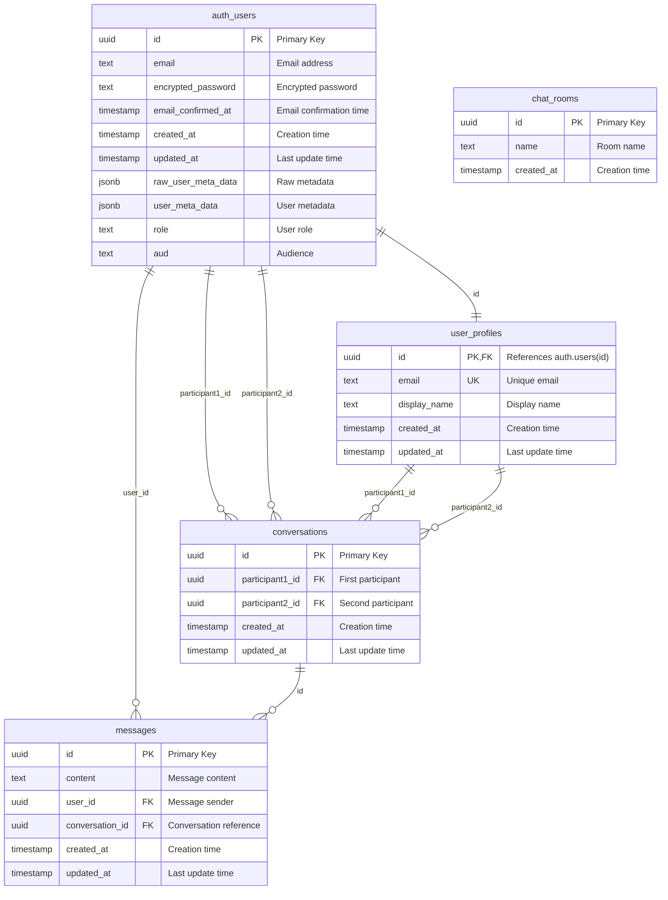

# システム設計図

## 概要
リアルタイムチャットアプリケーションの詳細な設計書。モジュール構成、データベース設計、API設計、リアルタイム通信設計について記載。

## モジュール構成

### 1. フロントエンド アーキテクチャ

```
src/
├── app/                              # Next.js App Router
│   ├── layout.tsx                   # ルートレイアウト (テーマプロバイダー)
│   ├── page.tsx                     # ホームページ
│   ├── globals.css                  # グローバルスタイル
│   ├── auth/                        # 認証関連ページ
│   │   ├── login/page.tsx          # ログインページ
│   │   ├── sign-up/page.tsx        # サインアップページ
│   │   ├── forgot-password/page.tsx # パスワードリセット
│   │   └── confirm/route.ts        # 認証確認API
│   ├── chat/                        # チャット関連ページ
│   │   ├── page.tsx                # チャット一覧ページ
│   │   └── [conversationId]/page.tsx # 個別チャットページ
│   └── protected/                   # 保護されたページ
│       ├── layout.tsx              # 保護されたレイアウト
│       └── page.tsx                # 保護されたページ
├── components/                      # Reactコンポーネント
│   ├── auth-button.tsx             # 認証ボタン
│   ├── chat-interface.tsx          # 公開チャットインターフェース
│   ├── conversations-list.tsx      # 会話一覧コンポーネント
│   ├── direct-message-interface.tsx # 1対1チャットインターフェース
│   ├── theme-switcher.tsx          # テーマ切替
│   ├── login-form.tsx              # ログインフォーム
│   ├── sign-up-form.tsx            # サインアップフォーム
│   └── ui/                         # UIコンポーネント (shadcn/ui)
│       ├── button.tsx              # ボタン
│       ├── input.tsx               # 入力フィールド
│       ├── card.tsx                # カード
│       ├── avatar.tsx              # アバター
│       └── scroll-area.tsx         # スクロールエリア
├── lib/                            # ライブラリ・ユーティリティ
│   ├── supabase/                   # Supabase設定
│   │   ├── client.ts               # クライアントサイド設定
│   │   ├── server.ts               # サーバーサイド設定
│   │   └── middleware.ts           # ミドルウェア設定
│   ├── types/                      # 型定義
│   │   ├── chat.ts                 # チャット関連型
│   │   ├── supabase.ts             # Supabase型
│   │   └── index.ts                # 型インデックス
│   └── utils/                      # ユーティリティ
│       ├── create-user-profile.ts  # ユーザープロファイル作成
│       └── utils.ts                # 汎用ユーティリティ
└── middleware.ts                   # Next.js ミドルウェア
```

### 2. コンポーネント設計

#### Chat Interface Components

```
ChatInterface (chat-interface.tsx)
├── Message Display
│   ├── ScrollArea (メッセージ一覧表示)
│   ├── MessageBubble (メッセージバブル)
│   └── Avatar (ユーザーアバター)
├── Message Input
│   ├── Input (メッセージ入力)
│   └── Button (送信ボタン)
└── Real-time Subscription (リアルタイム購読)

DirectMessageInterface (direct-message-interface.tsx)
├── Header
│   ├── Navigation (ナビゲーション)
│   └── User Info (相手ユーザー情報)
├── Message Display
│   ├── ScrollArea (メッセージ一覧)
│   └── MessageBubble (メッセージバブル)
└── Message Input
    ├── Input (メッセージ入力)
    └── Button (送信ボタン)

ConversationsList (conversations-list.tsx)
├── Search Interface
│   ├── Input (ユーザー検索)
│   └── SearchResults (検索結果)
├── Conversation List
│   ├── ConversationCard (会話カード)
│   └── UserAvatar (ユーザーアバター)
└── Action Buttons
    └── NewChatButton (新規チャットボタン)
```

## データベース設計

### Mermaid データベースER図



> **Note**: この図表はGitHub上で自動的に表示されます。  
> ソースファイル: [`docs/archi/diagrams/database-er.mmd`](./diagrams/database-er.mmd)

### データベース詳細情報

#### インデックス設計
- **conversations**: `participant1_id, participant2_id`, `updated_at DESC`, `participant1_id`, `participant2_id`
- **messages**: `created_at DESC`, `user_id`, `conversation_id`
- **user_profiles**: `email`

#### データベース関数
- `get_or_create_conversation(user1_id, user2_id)` - 会話の取得・作成
- `update_conversation_timestamp()` - 会話タイムスタンプ更新
- `update_updated_at_column()` - updated_at自動更新

#### トリガー
- **user_profiles**: `create_user_profile_trigger` (AFTER INSERT ON auth.users), `update_user_profiles_updated_at` (BEFORE UPDATE)
- **conversations**: `update_conversations_updated_at` (BEFORE UPDATE)
- **messages**: `update_conversation_timestamp_trigger` (AFTER INSERT), `update_messages_updated_at` (BEFORE UPDATE)

#### RLS ポリシー
- **user_profiles**: ユーザーは自分のプロファイルのみ表示・更新可能
- **conversations**: ユーザーは自分の参加する会話のみ表示・作成可能
- **messages**: ユーザーは自分の参加する会話のメッセージのみ表示・送信可能

### 1. テーブル設計

```sql
-- ユーザープロファイル
CREATE TABLE user_profiles (
    id UUID REFERENCES auth.users(id) ON DELETE CASCADE PRIMARY KEY,
    email TEXT UNIQUE,
    display_name TEXT,
    created_at TIMESTAMP WITH TIME ZONE DEFAULT NOW(),
    updated_at TIMESTAMP WITH TIME ZONE DEFAULT NOW()
);

-- 会話
CREATE TABLE conversations (
    id UUID DEFAULT gen_random_uuid() PRIMARY KEY,
    participant1_id UUID NOT NULL REFERENCES auth.users(id) ON DELETE CASCADE,
    participant2_id UUID NOT NULL REFERENCES auth.users(id) ON DELETE CASCADE,
    created_at TIMESTAMP WITH TIME ZONE DEFAULT NOW(),
    updated_at TIMESTAMP WITH TIME ZONE DEFAULT NOW(),
    UNIQUE(participant1_id, participant2_id),
    CONSTRAINT check_different_participants CHECK (participant1_id != participant2_id)
);

-- メッセージ
CREATE TABLE messages (
    id UUID DEFAULT gen_random_uuid() PRIMARY KEY,
    content TEXT NOT NULL,
    user_id UUID NOT NULL REFERENCES auth.users(id) ON DELETE CASCADE,
    conversation_id UUID NOT NULL REFERENCES conversations(id) ON DELETE CASCADE,
    created_at TIMESTAMP WITH TIME ZONE DEFAULT NOW(),
    updated_at TIMESTAMP WITH TIME ZONE DEFAULT NOW()
);

-- チャットルーム (将来拡張用)
CREATE TABLE chat_rooms (
    id UUID DEFAULT gen_random_uuid() PRIMARY KEY,
    name TEXT NOT NULL,
    created_at TIMESTAMP WITH TIME ZONE DEFAULT NOW()
);
```

### 2. インデックス設計

```sql
-- 会話テーブル
CREATE INDEX idx_conversations_participants ON conversations(participant1_id, participant2_id);
CREATE INDEX idx_conversations_updated_at ON conversations(updated_at DESC);
CREATE INDEX idx_conversations_participant1 ON conversations(participant1_id);
CREATE INDEX idx_conversations_participant2 ON conversations(participant2_id);

-- メッセージテーブル
CREATE INDEX idx_messages_created_at ON messages(created_at DESC);
CREATE INDEX idx_messages_user_id ON messages(user_id);
CREATE INDEX idx_messages_conversation_id ON messages(conversation_id);

-- ユーザープロファイル
CREATE INDEX idx_user_profiles_email ON user_profiles(email);
```

### 3. データベース関数

```sql
-- 会話取得・作成関数
CREATE OR REPLACE FUNCTION get_or_create_conversation(user1_id UUID, user2_id UUID)
RETURNS UUID AS $$
DECLARE
    conversation_id UUID;
    p1_id UUID;
    p2_id UUID;
BEGIN
    -- 一貫した順序でUUIDを並べる
    IF user1_id < user2_id THEN
        p1_id := user1_id;
        p2_id := user2_id;
    ELSE
        p1_id := user2_id;
        p2_id := user1_id;
    END IF;
    
    -- 既存の会話を検索
    SELECT id INTO conversation_id
    FROM conversations
    WHERE participant1_id = p1_id AND participant2_id = p2_id;
    
    -- 見つからない場合は新規作成
    IF conversation_id IS NULL THEN
        INSERT INTO conversations (participant1_id, participant2_id)
        VALUES (p1_id, p2_id)
        RETURNING id INTO conversation_id;
    END IF;
    
    RETURN conversation_id;
END;
$$ LANGUAGE plpgsql;

-- 会話タイムスタンプ更新関数
CREATE OR REPLACE FUNCTION update_conversation_timestamp()
RETURNS TRIGGER AS $$
BEGIN
    UPDATE conversations
    SET updated_at = NOW()
    WHERE id = NEW.conversation_id;
    RETURN NEW;
END;
$$ LANGUAGE plpgsql;

-- updated_at自動更新関数
CREATE OR REPLACE FUNCTION update_updated_at_column()
RETURNS TRIGGER AS $$
BEGIN
    NEW.updated_at = NOW();
    RETURN NEW;
END;
$$ LANGUAGE plpgsql;
```

### 4. トリガー設計

```sql
-- ユーザー作成時のプロファイル自動作成
CREATE TRIGGER create_user_profile_trigger
    AFTER INSERT ON auth.users
    FOR EACH ROW
    EXECUTE FUNCTION create_user_profile();

-- メッセージ作成時の会話タイムスタンプ更新
CREATE TRIGGER update_conversation_timestamp_trigger
    AFTER INSERT ON messages
    FOR EACH ROW
    EXECUTE FUNCTION update_conversation_timestamp();

-- updated_at自動更新
CREATE TRIGGER update_user_profiles_updated_at
    BEFORE UPDATE ON user_profiles
    FOR EACH ROW
    EXECUTE FUNCTION update_updated_at_column();

CREATE TRIGGER update_conversations_updated_at
    BEFORE UPDATE ON conversations
    FOR EACH ROW
    EXECUTE FUNCTION update_updated_at_column();

CREATE TRIGGER update_messages_updated_at
    BEFORE UPDATE ON messages
    FOR EACH ROW
    EXECUTE FUNCTION update_updated_at_column();
```

## API設計

### 1. 認証API

```typescript
// Supabase Auth API
interface AuthAPI {
  signUp(email: string, password: string): Promise<AuthResponse>;
  signIn(email: string, password: string): Promise<AuthResponse>;
  signOut(): Promise<void>;
  resetPassword(email: string): Promise<void>;
  updatePassword(newPassword: string): Promise<void>;
  getUser(): Promise<User | null>;
  getSession(): Promise<Session | null>;
}
```

### 2. チャット API

```typescript
// メッセージAPI
interface MessageAPI {
  // メッセージ一覧取得
  getMessages(conversationId: string): Promise<MessageWithUser[]>;
  
  // メッセージ送信
  sendMessage(params: {
    content: string;
    userId: string;
    conversationId: string;
  }): Promise<Message>;
  
  // メッセージ削除
  deleteMessage(messageId: string): Promise<void>;
  
  // メッセージ編集
  updateMessage(messageId: string, content: string): Promise<Message>;
}

// 会話API
interface ConversationAPI {
  // 会話一覧取得
  getConversations(userId: string): Promise<ConversationWithParticipants[]>;
  
  // 会話作成・取得
  getOrCreateConversation(user1Id: string, user2Id: string): Promise<string>;
  
  // 会話削除
  deleteConversation(conversationId: string): Promise<void>;
}

// ユーザーAPI
interface UserAPI {
  // ユーザー検索
  searchUsers(query: string, currentUserId: string): Promise<UserProfile[]>;
  
  // ユーザープロファイル取得
  getUserProfile(userId: string): Promise<UserProfile>;
  
  // ユーザープロファイル更新
  updateUserProfile(userId: string, profile: Partial<UserProfile>): Promise<UserProfile>;
}
```

### 3. 型定義

```typescript
// 基本型
export type Message = Database['public']['Tables']['messages']['Row'];
export type Conversation = Database['public']['Tables']['conversations']['Row'];
export type UserProfile = Database['public']['Tables']['user_profiles']['Row'];

// 拡張型
export interface MessageWithUser extends Message {
  user?: {
    email?: string;
    display_name?: string;
  } | null;
}

export interface ConversationWithParticipants extends Conversation {
  participant1?: UserProfile | null;
  participant2?: UserProfile | null;
  other_participant?: UserProfile | null;
  last_message?: Message | null;
}

// API パラメータ型
export interface SendMessageParams {
  content: string;
  user_id: string;
  conversation_id: string;
}

export interface CreateConversationParams {
  user1_id: string;
  user2_id: string;
}
```

## リアルタイム通信設計

### 1. Supabase Realtime設定

```typescript
// リアルタイム購読設定
const setupRealtimeSubscription = (conversationId: string) => {
  const channel = supabase
    .channel(`messages:${conversationId}`)
    .on(
      'postgres_changes',
      {
        event: '*',
        schema: 'public',
        table: 'messages',
        filter: `conversation_id=eq.${conversationId}`,
      },
      (payload) => {
        handleRealtimeMessage(payload);
      }
    )
    .subscribe();

  return channel;
};

// メッセージハンドリング
const handleRealtimeMessage = (payload: RealtimeMessage) => {
  switch (payload.eventType) {
    case 'INSERT':
      addNewMessage(payload.new);
      break;
    case 'UPDATE':
      updateMessage(payload.new);
      break;
    case 'DELETE':
      removeMessage(payload.old);
      break;
  }
};
```

### 2. WebSocket接続管理

```typescript
// 接続状態管理
interface RealtimeConnection {
  status: 'connecting' | 'connected' | 'disconnected' | 'error';
  channel: RealtimeChannel | null;
  reconnectAttempts: number;
  maxReconnectAttempts: number;
}

// 自動再接続機能
const setupAutoReconnect = (conversationId: string) => {
  const reconnectInterval = setInterval(() => {
    if (connection.status === 'disconnected' && 
        connection.reconnectAttempts < connection.maxReconnectAttempts) {
      reconnectToRealtime(conversationId);
      connection.reconnectAttempts++;
    }
  }, 5000);

  return reconnectInterval;
};
```

## セキュリティ設計

### 1. Row Level Security (RLS)

```sql
-- ユーザープロファイル: 自分の情報のみ読み書き可能
CREATE POLICY "Users can view own profile" ON user_profiles
    FOR SELECT USING (auth.uid() = id);

CREATE POLICY "Users can update own profile" ON user_profiles
    FOR UPDATE USING (auth.uid() = id);

-- 会話: 参加者のみ読み取り可能
CREATE POLICY "Users can view own conversations" ON conversations
    FOR SELECT USING (
        auth.uid() = participant1_id OR auth.uid() = participant2_id
    );

CREATE POLICY "Users can create conversations" ON conversations
    FOR INSERT WITH CHECK (
        auth.uid() = participant1_id OR auth.uid() = participant2_id
    );

-- メッセージ: 会話参加者のみ読み書き可能
CREATE POLICY "Users can view messages in their conversations" ON messages
    FOR SELECT USING (
        EXISTS (
            SELECT 1 FROM conversations
            WHERE conversations.id = messages.conversation_id
            AND (conversations.participant1_id = auth.uid() 
                OR conversations.participant2_id = auth.uid())
        )
    );

CREATE POLICY "Users can send messages to their conversations" ON messages
    FOR INSERT WITH CHECK (
        auth.uid() = user_id AND
        EXISTS (
            SELECT 1 FROM conversations
            WHERE conversations.id = messages.conversation_id
            AND (conversations.participant1_id = auth.uid() 
                OR conversations.participant2_id = auth.uid())
        )
    );
```

### 2. 認証フロー

```typescript
// ミドルウェアによる認証チェック
export async function middleware(request: NextRequest) {
  const { supabase, response } = await createClient(request);
  
  const { data: { user } } = await supabase.auth.getUser();
  
  // 保護されたルートのチェック
  const isProtectedRoute = request.nextUrl.pathname.startsWith('/protected');
  const isChatRoute = request.nextUrl.pathname.startsWith('/chat');
  
  if ((isProtectedRoute || isChatRoute) && !user) {
    return NextResponse.redirect(new URL('/auth/login', request.url));
  }
  
  return response;
}
```

## パフォーマンス最適化

### 1. データベース最適化

```sql
-- 複合インデックス
CREATE INDEX idx_conversations_participant_updated 
ON conversations(participant1_id, participant2_id, updated_at DESC);

-- 部分インデックス
CREATE INDEX idx_recent_messages 
ON messages(conversation_id, created_at DESC) 
WHERE created_at > NOW() - INTERVAL '30 days';
```

### 2. フロントエンド最適化

```typescript
// React.memo による再レンダリング最適化
const MessageBubble = React.memo(({ message }: { message: MessageWithUser }) => {
  return (
    <div className="message-bubble">
      {message.content}
    </div>
  );
});

// useMemo によるデータ処理最適化
const sortedMessages = useMemo(() => {
  return messages.sort((a, b) => 
    new Date(a.created_at).getTime() - new Date(b.created_at).getTime()
  );
}, [messages]);

// useCallback によるコールバック最適化
const handleSendMessage = useCallback((content: string) => {
  // メッセージ送信ロジック
}, [conversationId, user.id]);
```

## 監視・ログ設計

### 1. エラーハンドリング

```typescript
// エラーバウンダリ
class ChatErrorBoundary extends React.Component {
  constructor(props: any) {
    super(props);
    this.state = { hasError: false };
  }

  static getDerivedStateFromError(error: Error) {
    return { hasError: true };
  }

  componentDidCatch(error: Error, errorInfo: React.ErrorInfo) {
    console.error('Chat error:', error, errorInfo);
    // エラーログの送信
  }

  render() {
    if (this.state.hasError) {
      return <h1>Something went wrong in chat.</h1>;
    }

    return this.props.children;
  }
}
```

### 2. パフォーマンス監視

```typescript
// パフォーマンス測定
const measurePerformance = (name: string, fn: () => void) => {
  const start = performance.now();
  fn();
  const end = performance.now();
  console.log(`${name} took ${end - start} milliseconds`);
};

// レンダリング回数の監視
const useRenderCount = () => {
  const renderCount = useRef(0);
  renderCount.current++;
  console.log(`Render count: ${renderCount.current}`);
};
```

## 今後の拡張計画

### 1. グループチャット機能
- `chat_rooms` テーブルの活用
- 複数参加者対応
- 管理者権限システム

### 2. メディア共有機能
- 画像・動画の送信
- ファイル添付機能
- Supabase Storage との連携

### 3. 通知システム
- リアルタイム通知
- プッシュ通知
- メール通知

### 4. 高度な機能
- メッセージ検索
- メッセージ暗号化
- 既読・未読管理
- ユーザーステータス機能